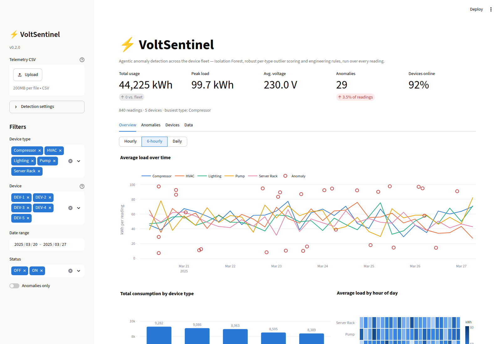

# ⚡ VoltSentinel

**AI-powered energy monitoring for industrial device fleets.** VoltSentinel scores
every telemetry reading against three complementary anomaly detectors and puts the
result behind an interactive Streamlit dashboard — so a phantom load, a sagging
supply voltage or a device quietly drifting out of profile surfaces immediately
instead of at the end of the billing cycle.




---

## Quickstart

```bash
git clone https://github.com/alloysArtifexLabs/volt-sentinel-ai-dashboard.git
cd volt-sentinel-ai-dashboard

python -m venv .venv && source .venv/bin/activate   # Windows: .venv\Scripts\activate
pip install -r requirements.txt

streamlit run app.py
```

The dashboard opens on <http://localhost:8501> against the bundled sample fleet —
five devices, hourly readings across a week. Drop your own CSV into the sidebar
uploader to score real telemetry instead.

For development (tests, linting, an editable install):

```bash
pip install -e ".[dev]"
pytest          # 39 tests
ruff check .
```

## How readings are scored

Every reading passes through three detectors. They are deliberately different in
kind, so a fault that hides from one is caught by another.

| Detector | What it catches | Why it exists |
|---|---|---|
| **Engineering rules** | A device reporting `OFF` while still drawing power; supply voltage outside its acceptable band | Encodes what a technician would spot by eye. Zero false-positive tolerance, fully explainable. |
| **Robust z-score** | A reading far from the norm **for its own device type** | Uses median/MAD rather than mean/σ, so the outlier it is hunting does not inflate the spread it is measured against. A server rack is compared to server racks, never to lighting. |
| **Isolation Forest** | Odd *combinations* — normal load at an abnormal hour, normal voltage at an abnormal load | Learns the fleet's joint distribution over usage, voltage, time-of-day (encoded cyclically) and on/off state. Catches what no single-column threshold can. |

Results are blended into an `anomaly_score` (0–1): 60% Isolation Forest score,
40% how many detectors agree — so a reading that trips three checks outranks one
that just crossed a threshold. Every flagged reading carries a plain-English
`anomaly_reasons` string explaining which detector fired.

All thresholds are live controls in the sidebar (**Detection settings**), so you
can tighten or relax the fleet's sensitivity and watch the flag counts move.

## What's in the dashboard

- **Overview** — load over time with anomalies overlaid (roll up hourly / 6-hourly /
  daily), consumption per device type, an hour-of-day heatmap, and supply voltage
  plotted against its acceptable band.
- **Anomalies** — a per-detector breakdown, load-vs-voltage shaded by anomaly score,
  and a sortable table of flagged readings with a CSV export.
- **Devices** — every device ranked by the anomalies it raised, plus per-type rollups.
- **Data** — the filtered readings themselves, exportable, with the scoring rules
  documented inline.

Filters (device type, individual device, date range, status, anomalies-only) apply
across every tab.

## Project layout

```
app.py                      Streamlit entrypoint — layout and widgets only
src/voltsentinel/
├── config.py               Thresholds, paths and column contracts (env-overridable)
├── data.py                 CSV loading, schema validation, normalisation
├── detection.py            The three detectors and the blended score
├── metrics.py              Fleet aggregations behind the KPIs and tables
├── charts.py               Plotly figures
└── theme.py                Palette and shared chart template
tests/                      39 tests over data, detection, metrics and charts
scripts/generate_data.py    Regenerate the simulated dataset
data/                       Bundled sample telemetry
```

Business logic lives in `src/voltsentinel/` and is import-safe without Streamlit,
which is what makes it testable — `app.py` only wires widgets to it.

## Deploying

The app is a **persistent Python server**, not a static site: the browser holds
an open WebSocket to `/_stcore/stream`, and every slider move re-scores the
fleet in a live Python process. That rules out serverless/edge hosts such as
Vercel, Netlify and Cloudflare Pages, which do not hold WebSocket connections —
the app would build there and then hang on "Please wait...". Deploy it anywhere
that runs a long-lived process.

### Streamlit Community Cloud (free, no extra config)

The repo is deploy-ready as-is — `app.py` at the root, `requirements.txt`
alongside it, and no build step:

1. Push to GitHub (this repo already is).
2. Sign in to <https://share.streamlit.io> with the GitHub account that owns
   the repo.
3. Create a new app pointing at this repository, branch `main`, main file
   `app.py`.
4. Deploy. First boot takes a couple of minutes while dependencies install.

`app.py` puts `src/` on `sys.path` itself, so the package resolves without
`pip install -e .` — verified by installing **only** `requirements.txt` into a
clean environment and rendering every tab. If the host offers a Python version
choice, pick one CI covers (3.10 or 3.12).

### Any container host (Render, Fly.io, Railway, Cloud Run)

No Dockerfile is committed, but the run command is a one-liner if you add one:

```bash
streamlit run app.py --server.port $PORT --server.address 0.0.0.0 --server.headless true
```

Bind to `0.0.0.0` and read the port from the platform's `$PORT` variable, or the
health check will never pass.

## Bring your own data

Upload any CSV carrying these columns:

| Column | Type | Notes |
|---|---|---|
| `timestamp` | datetime | Any format pandas can parse |
| `device_id` | string | Unique per physical device |
| `device_type` | string | The peer group a device is scored against |
| `usage_kwh` | float | Energy drawn during the interval |
| `voltage` | float | Supply voltage at the reading |
| `status` | string | `ON` / `OFF` (case-insensitive) |

`hour` is derived from the timestamp rather than trusted from the file. If the
export carries `anomaly_flag` / `ai_anomaly_flag` columns they are preserved as
`baseline_rule_flag` / `baseline_ai_flag` and compared against the live model on
the Anomalies tab. Unparseable rows are dropped rather than crashing the app.

## Configuration

Defaults live in `src/voltsentinel/config.py` and can be overridden with
environment variables, which is the hook for deployment:

```bash
export VOLTSENTINEL_DATA_PATH=/srv/telemetry/latest.csv
export VOLTSENTINEL_CONTAMINATION=0.05      # expected anomaly rate
export VOLTSENTINEL_PHANTOM_LOAD_KWH=75     # OFF-but-drawing threshold
export VOLTSENTINEL_VOLTAGE_MIN=225
export VOLTSENTINEL_VOLTAGE_MAX=235
streamlit run app.py
```

## Regenerating the sample data

```bash
python scripts/generate_data.py --hours 336 --seed 7 --out data/my_fleet.csv
```

The generator applies a daily load curve per device type and injects both fault
modes (phantom loads and voltage excursions), so the detectors have something
real to find.

## Notes on the sample dataset

The bundled readings are drawn from a near-uniform distribution, which means the
per-type z-score detector rarely fires on them at its default sensitivity — the
readings are unusual in *combination*, not in magnitude, which is exactly what the
Isolation Forest is there for. Lower the sensitivity slider, or generate data with
`scripts/generate_data.py`, to see that detector working.

---

Developed by **ArtifexLabs** · Agentic AI for energy monitoring
